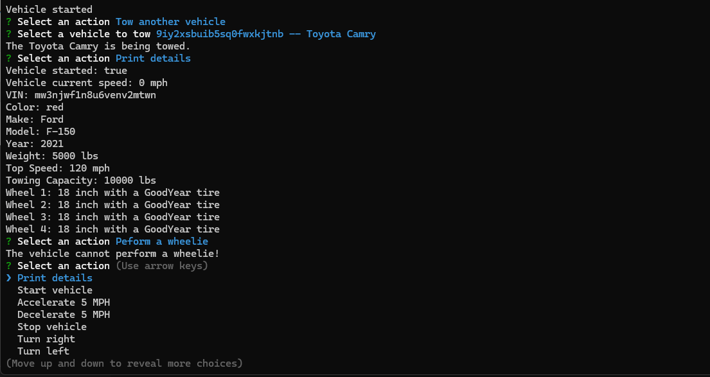

# VehicleBuilder

A command-line application for creating and simulating vehicles including cars, trucks and motorbikes.

## Table of Contents

- [Installation](#installation)
- [Usage](#usage)
- [License](#license)
- [Questions](#questions)
- [Demo](#demo)

## Installation

After cloning, run `npm ci` to install dependencies.

## Usage

To run the program, type `npm start` at the command line. You'll then be able to respond to the prompts to create or select vehicles, and then simulate their usage. All vehicles can be started and driven. Trucks additionally can tow other vehicles up to their towing capacity. Motorbikes can perform wheelies.

## License

This project is governed by The MIT License. For more information, click or tap on the badge below.

## Questions

I can be reached with questions at https://www.github.com/Prelle or via email at p.elayne.terry@gmail.com.

## Demo

https://www.youtube.com/watch?v=CW96USkz0CI